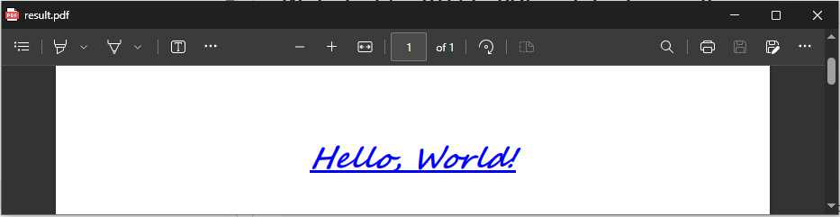
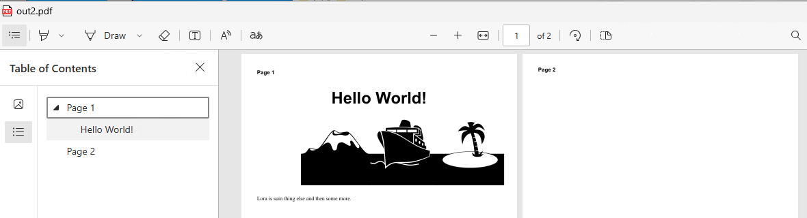
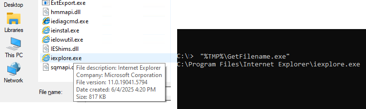
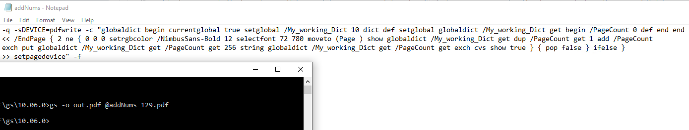

## SMOP
(Small Matters Of Programming)
---
"A humorous term in software development indicating that a proposed change or feature may seem simple but actually requires significant effort to implement. It often highlights the irony that what appears easy can be quite complex in reality."  
or  
"A piece of code, not yet written, whose anticipated length is significantly greater than its complexity. Used to refer to a program that could obviously be written, but is not worth the trouble. Also used ironically to imply that a difficult problem can be easily solved because a program can be written to do it; the irony is that it is very clear that writing such a program will be a great deal of work."  

### Technically, these do not qualify as SMOPs.  
However these small programs have taken considerable time to test and improve. So as to present simple PoCs (Proof of Concepts).

### Single-line Windows CMD scripts
---
[Beware when using redirection symbols the use of escapes or space after a #  before may be critical]
## Write Text (or RTF) to PDF and display result
TXT  
```cmd
set "out=%tmp%\h.txt" & (echo. &echo Page 1 of 1&echo. &echo                       Hello, World!) > "%out%"&write /pt %out% "Microsoft Print to PDF" "Microsoft Print to PDF" %public%\documents\result.pdf&timeout 3 >nul&&del %out%&&start msedge --app=%public%\documents\result.pdf
```
RTF
```cmd
echo {\rtf1\ansi{\colortbl ;\red0\green0\blue255;}{\fonttbl{\f0\fnil Segoe Script;}{\f1\fnil Comic Sans MS;}}\qc\par\par\par\par\b\i\ul\cf1\f0\fs48 Hello, World!\b0\i0\ulnone\par} > %tmp%\h.rtf&write /pt %tmp%\h.rtf "Microsoft Print to PDF" "Microsoft Print to PDF" %public%\documents\result.pdf&timeout 3 >nul&del %tmp%\h.rtf&start msedge --app=%public%\documents\result.pdf
```


# HTML
**NOTE current msedge version 141 is again having problems related to user folder** so you need a temporary user folder as shown in first example
After all runs are done then delete that temp folder using RD.
```
start msedge --headless=new --log-level=3 --user-data-dir="%cd%\temp" --no-pdf-header-footer --print-to-pdf="%cd%/print.pdf" "https://example.com" >nul&&timeout 3 >nul&&echo.
```
```
cmd /r start msedge --headless=new --no-pdf-header-footer --print-to-pdf="C:\Users\Public\Documents\out.pdf" "data:text/html,<title>Hello World PDF</title><style>@page{size:A4}</style><body>Page 1<div style=font-family:Helvetica;font-size:10mm;text-align:center;><p>Hello World!</p><p style=font-family:webdings;font-size:200px;>MTJ</p></div><div style=page-break-before:always;>Page 2</div></body>">nul 2>&1 &&(for /l %i in (1,1,9) do (@if exist "C:\Users\Public\Documents\out.pdf" start msedge --app="C:\Users\Public\Documents\out.pdf" &exit)&timeout /t 1 >nul)
```


Notepad goto line number
---
This may seem at first a bit "niche" as my need is in SumatraPDF to use for Synctex Inverse Search. However if you replace "%f" with a filename and %l with a number it can be easily used for other methodologies.  
>Note: `fWrap` controls line wrapping in Notepad, for "goto" line navigation `fWrap` must be set to `0` first. As presented here there will be a "black box" for a few seconds but will auto close.
### CMD Example
```cmd
CMD.exe /r "reg add "HKCU\Software\Microsoft\Notepad" /v fWrap /t REG_DWORD /d 0 /f >nul&echo Set s=CreateObject("WScript.Shell"):s.Run("%windir%\notepad.exe " ^& WScript.Arguments(0)):WScript.Sleep 999:s.SendKeys("%EG" ^& WScript.Arguments(1) ^& "{enter}+{end}")>%tmp%\n.vbs&cscript //nologo %tmp%\n.vbs "sync.tex" 15&&timeout 2 >nul&del %tmp%\n.vbs"
```
Note the 3 seconds console in the background can be reduced to a minimal flash by starting the command as:
```
InverseSearchCmdLine =cmd /c start "" /MIN CMD.exe /r "reg add....
```
But without a more dedicated shim.vbs is just a cosmetic workaround.


# Win#Exe
---
Did you know Windows has the ability to write complex graphics apps (like even replace itself with a faster leaner version)?  
I digress, what is possible in one line is a graphics WinForm, but for an RTF Editor replacement for WritePad# we would not be able to use one line.

## A Titanic Application

```cmd
echo using System;using System.Media;using System.Windows.Forms;using System.Drawing;class X{static void Main(){int bounce = 0;var f=new Form(){Text="Titanic Encounter",Width=660,Height=400,BackColor=Color.Blue};var j=new Label(){Text="J",Font=new Font("Webdings",90),ForeColor=Color.Gold,AutoSize=true,Location=new Point(490,125)};var m=new Label(){Text="M",Font=new Font("Webdings",70),BackColor=Color.Blue,ForeColor=Color.Gray,AutoSize=true,Location=new Point(-10,160)};var t=new Label(){Text="T",Font=new Font("Webdings",70),ForeColor=Color.FromArgb(0,128,255),AutoSize=true,Location=new Point(500,150)};f.Controls.AddRange(new Control^[^]{j,t,m});var size=72;var x=500;var y=150;var timer=new Timer(){Interval=100};timer.Tick+=delegate{if(x^>110){x-=10;t.Location=new Point(x,y);}else if(size^>4){var player = new SoundPlayer(@"C:\Windows\Media\Windows Hardware Fail.wav");player.Play();size-=3;x-=2;y+=9;t.Font=new Font("Webdings",size);t.Location=new Point(x,y);bounce++;m.Location=new Point(-10,150+(int)(Math.Sin(bounce*0.5)*10));}else{timer.Stop();}};timer.Start();Application.Run(f);}} > x.cs && "%WINDIR%\Microsoft.NET\Framework\v4.0.30319\csc.exe" x.cs & x.exe
```
## A RO File Picker
Sometimes we simply want in cmd to pick a file or folder by exploring and write the chosen folder\filename back to the console.
```
echo using System;using System.Windows.Forms;class P{^[STAThread^]static void Main(){var o=new OpenFileDialog();o.InitialDirectory=Environment.CurrentDirectory;o.ReadOnlyChecked=true;o.ShowReadOnly=true;if(o.ShowDialog()==DialogResult.OK)Console.WriteLine(o.FileName);}} > "%TMP%\GetFilename.cs" && "%WINDIR%\Microsoft.NET\Framework\v4.0.30319\csc.exe" /nologo /out:"%TMP%\GetFilename.exe" "%TMP%\GetFilename.cs" && del "%TMP%\GetFilename.cs"
```

## A RO Folder Picker
```
echo using System;using System.Windows.Forms;class P{^[STAThread^]static void Main(){var o=new FolderBrowserDialog();if(o.ShowDialog()==DialogResult.OK)Console.WriteLine(o.SelectedPath);}} > "%TMP%\GetFolder.cs" && "%WINDIR%\Microsoft.NET\Framework\v4.0.30319\csc.exe" /nologo /out:"%TMP%\GetFolder.exe" "%TMP%\GetFolder.cs" && del "%TMP%\GetFolder.cs"
```

# Ghostscript
This is a collection of single line commands but some depend on a split line in a file.extension due to windows limitations.
- Ghostscript is NOT a "file compressor" it writes NEW optimised files using compression. For removing encryption and adjusting compression use a PDF transformer such as cpdf or qpdf.
- Ghostscript is NOT a "file merging" program it writes a collection of NEW pages from one or more files pages. For true merging use a PDF Transformer such as cpdf or qpdf.

Take for an example Ghostscript can collate many files as new pages but windows limits how many names may be allowed on a single line. We can avoid that by using:
## collect files command (default) Without **or with overprinted text** such as simple increasing numbers.
```
gs -q -sDEVICE=pdfwrite -o pages.pdf  @filelist.txt
```
Where the files are in the **command file filelist.txt** (ensure any filenames with spaces are "double quoted") you only need `-f` if there are commands before the listed files. The nice bonus is we can add commands to add say page numbers like this @filelist.txt
- /NimbusSans-Bold 12 is the style and height
- 72 780 is the X Y position Thus near top left corner (from the lower left origin) thus any position is possible but dont expect perfect centering.
- (Page ) is the text before the number there are no leading zer0's, no trailing text. So used as bates numbers `Exhibit A-25 - Page ` will be simple 1 to last or stamping ticket pages the numbers will expand rightwards from 1 to 10 to 100 to 1000
```
-c "globaldict begin currentglobal true setglobal /My_working_Dict 10 dict def setglobal globaldict /My_working_Dict get begin /PageCount 0 def end end 
<< /EndPage { 2 ne { 0 0 0 setrgbcolor /NimbusSans-Bold 12 selectfont 72 780 moveto (Page ) show globaldict /My_working_Dict get dup /PageCount get 1 add /PageCount
exch put globaldict /My_working_Dict get /PageCount get 256 string globaldict /My_working_Dict get /PageCount get exch cvs show true } { pop false } ifelse }
>> setpagedevice" -f 
my1.pdf
"number 2.pdf"
"d:\a folder\file3.pdf"
```
If you want to try that on a folder full of pdfs just use the one line
```
(for %f in (*.pdf) do @echo "%f") > filelist.txt && gs -sDEVICE=pdfwrite -o out.pdf -c "globaldict begin currentglobal true setglobal /My_working_Dict 10 dict def setglobal globaldict /My_working_Dict get begin /PageCount 0 def end end << /EndPage { 2 ne { 0 0 0 setrgbcolor /NimbusSans-Bold 12 selectfont 72 780 moveto (Page ) show globaldict /My_working_Dict get dup /PageCount get 1 add /PageCount exch put globaldict /My_working_Dict get /PageCount get 256 string globaldict /My_working_Dict get /PageCount get exch cvs show true } { pop false } ifelse } >> setpagedevice" -f @filelist.txt
```
For a single file do not write a list. So use a command file with just the section starting `-c ... one line as above ending ... -f` call it addNumbers.txt
```
gs -q -sDEVICE=pdfwrite -o pages.pdf  @addNumbers.txt filename.pdf
```
You could include the -q and -sDEVICE in the @command file then it is as simple as `gs -o output.pdf @addNums filename.pcl` (note GS is case sensitive.)


Postscript is a powerful programming language and this is only a small demonstration of ability to place text as an overprint.

```
-sDEVICE=pdfwrite -c "globaldict begin currentglobal true setglobal /My_working_Dict 10 dict def setglobal globaldict /My_working_Dict get begin /PageCount 0 def end end 
<< /EndPage { 2 ne { 
1 0 0 setrgbcolor
/NimbusSans-Bold 12 selectfont
72 780 moveto 
(Exhibit A Page ) show
globaldict /My_working_Dict get dup /PageCount get 1 add /PageCount exch put globaldict /My_working_Dict get /PageCount get 256 string globaldict /My_working_Dict get /PageCount get exch cvs show
( of 129) show
true } { pop false } ifelse }
>> setpagedevice" -f 
```
Note the above assumes you know the total number first and GS could be used to combine and OR show number of pages for the second pass to write the text. However, there is a better way using an application like pdfcpu or coherent cpdf which at its most basic will look like:
```
cpdf -add-text "Page %Page of %EndPage" -topright 20pt -font "Helvetica" -font-size 14 in.pdf -o out.pdf
```


