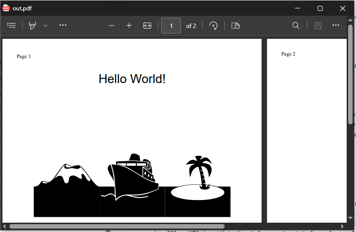

## SMOP
(Small Matters Of Programming)
---
"A humorous term in software development indicating that a proposed change or feature may seem simple but actually requires significant effort to implement. It often highlights the irony that what appears easy can be quite complex in reality."  
or  
"A piece of code, not yet written, whose anticipated length is significantly greater than its complexity. Used to refer to a program that could obviously be written, but is not worth the trouble. Also used ironically to imply that a difficult problem can be easily solved because a program can be written to do it; the irony is that it is very clear that writing such a program will be a great deal of work."  

### Technically, these do not qualify as SMOPs.  
However these small programs have taken considerable time to test and improve. So as to present simple PoCs (Proof of Concepts) .

### Single-line Windows CMD scripts
---
[Beware when using redirection symbols the use of escapes or space after a #  before may be critical]
## Write Text (or RTF) to PDF and display result
TXT  
```cmd
set "out=%tmp%\h.txt" & (echo. &echo Page 1 of 1&echo. &echo                       Hello, World!) > "%out%"&write /pt %out% "Microsoft Print to PDF" "Microsoft Print to PDF" %public%\documents\result.pdf&timeout 3 >nul&&del %out%&&start msedge --app=%public%\documents\result.pdf
```
RTF
```cmd
echo {\rtf1\ansi{\colortbl ;\red0\green0\blue255;}{\fonttbl{\f0\fnil Segoe Script;}{\f1\fnil Comic Sans MS;}}\qc\par\par\par\par\b\i\ul\cf1\f0\fs48 Hello, World!\b0\i0\ulnone\par} > %tmp%\h.rtf&write /pt %tmp%\h.rtf "Microsoft Print to PDF" "Microsoft Print to PDF" %public%\documents\result.pdf&timeout 3 >nul&del %tmp%\h.rtf&start msedge --app=%public%\documents\result.pdf
```


HTML
```
cmd /r start msedge --headless=new --no-pdf-header-footer --print-to-pdf="C:\Users\Public\Documents\out.pdf" "data:text/html,<title>Hello World PDF</title><style>@page{size:A4}</style><body>Page 1<div style=font-family:Helvetica;font-size:10mm;text-align:center;><p>Hello World!</p><p style=font-family:webdings;font-size:200px;>MTJ</p></div><div style=page-break-before:always;>Page 2</div></body>">nul 2>&1 &&(for /l %i in (1,1,9) do (@if exist "C:\Users\Public\Documents\out.pdf" start msedge --app="C:\Users\Public\Documents\out.pdf" &exit)&timeout /t 1 >nul)
```


Notepad goto line number
---
This may seem at first a bit "niche" as my need is in SumatraPDF to use for Synctex Inverse Search. However if you replace "%f" with a filename and %l with a number it can be easily used for other methodologies.  
>Note: `fWrap` controls line wrapping in Notepad, for "goto" line navigation `fWrap` must be set to `0` first. As presented here there will be a "black box" for a few seconds but will auto close.
### CMD Example
```cmd
CMD.exe /r "reg add "HKCU\Software\Microsoft\Notepad" /v fWrap /t REG_DWORD /d 0 /f >nul&echo Set s=CreateObject("WScript.Shell"):s.Run("%windir%\notepad.exe " ^& WScript.Arguments(0)):WScript.Sleep 999:s.SendKeys("%EG" ^& WScript.Arguments(1) ^& "{enter}+{end}")>%tmp%\n.vbs&cscript //nologo %tmp%\n.vbs "sync.tex" 15&&timeout 2 >nul&del %tmp%\n.vbs"
```
Note the 3 seconds console in the background can be reduced to a minimal flash by starting the command as:
```
InverseSearchCmdLine =cmd /c start "" /MIN CMD.exe /r "reg add....
```
But without a more dedicated shim.vbs is just a cosmetic workaround.


# Win#Exe
---
Did you know Windows has the ability to write complex graphics apps (like even replace its self with a faster leaner version)?  
I digress, what is posible in one line is a grahics WinForm, but for an RTF Editor replacement for WritePad# we would not be able to use one line.

## A Titanic Application

```cmd
echo using System;using System.Media;using System.Windows.Forms;using System.Drawing;class X{static void Main(){int bounce = 0;var f=new Form(){Text="Titanic Encounter",Width=660,Height=400,BackColor=Color.Blue};var j=new Label(){Text="J",Font=new Font("Webdings",90),ForeColor=Color.Gold,AutoSize=true,Location=new Point(490,125)};var m=new Label(){Text="M",Font=new Font("Webdings",70),BackColor=Color.Blue,ForeColor=Color.Gray,AutoSize=true,Location=new Point(-10,160)};var t=new Label(){Text="T",Font=new Font("Webdings",70),ForeColor=Color.FromArgb(0,128,255),AutoSize=true,Location=new Point(500,150)};f.Controls.AddRange(new Control^[^]{j,t,m});var size=72;var x=500;var y=150;var timer=new Timer(){Interval=100};timer.Tick+=delegate{if(x^>110){x-=10;t.Location=new Point(x,y);}else if(size^>4){var player = new SoundPlayer(@"C:\Windows\Media\Windows Hardware Fail.wav");player.Play();size-=3;x-=2;y+=9;t.Font=new Font("Webdings",size);t.Location=new Point(x,y);bounce++;m.Location=new Point(-10,150+(int)(Math.Sin(bounce*0.5)*10));}else{timer.Stop();}};timer.Start();Application.Run(f);}} > x.cs && "%WINDIR%\Microsoft.NET\Framework\v4.0.30319\csc.exe" x.cs & x.exe
```
## A RO File Picker
Sometimes we simply want in cmd to pick a file or folder by exploring and write the chosen folder\filename back to the console.
```
echo using System;using System.Windows.Forms;class P{^[STAThread^]static void Main(){var o=new OpenFileDialog();o.InitialDirectory=Environment.CurrentDirectory;o.ReadOnlyChecked=true;o.ShowReadOnly=true;if(o.ShowDialog()==DialogResult.OK)Console.WriteLine(o.FileName);}} > "%TMP%\GetFilename.cs" && "%WINDIR%\Microsoft.NET\Framework\v4.0.30319\csc.exe" /nologo /out:"%TMP%\GetFilename.exe" "%TMP%\GetFilename.cs" && del "%TMP%\GetFilename.cs"
```

## A RO Folder Picker
```
echo using System;using System.Windows.Forms;class P{^[STAThread^]static void Main(){var o=new FolderBrowserDialog();if(o.ShowDialog()==DialogResult.OK)Console.WriteLine(o.SelectedPath);}} > "%TMP%\GetFolder.cs" && "%WINDIR%\Microsoft.NET\Framework\v4.0.30319\csc.exe" /nologo /out:"%TMP%\GetFolder.exe" "%TMP%\GetFolder.cs" && del "%TMP%\GetFolder.cs"
```
